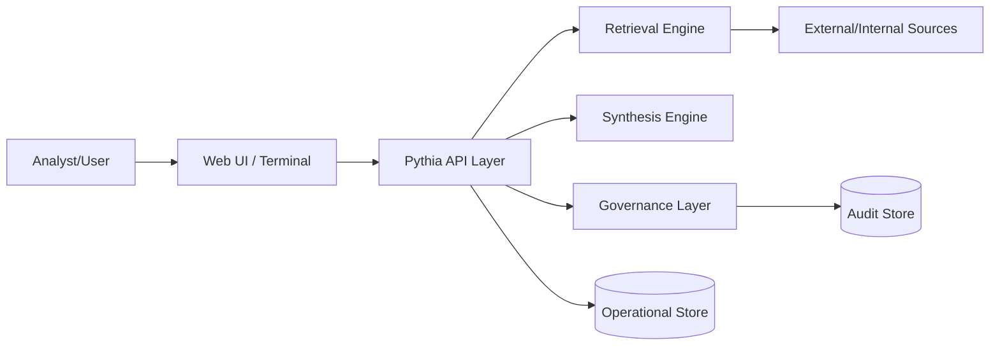
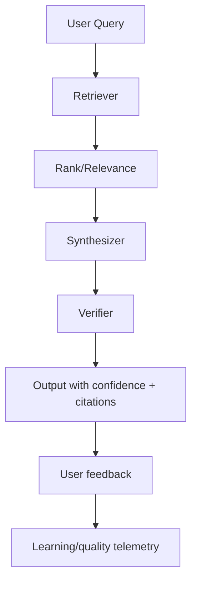
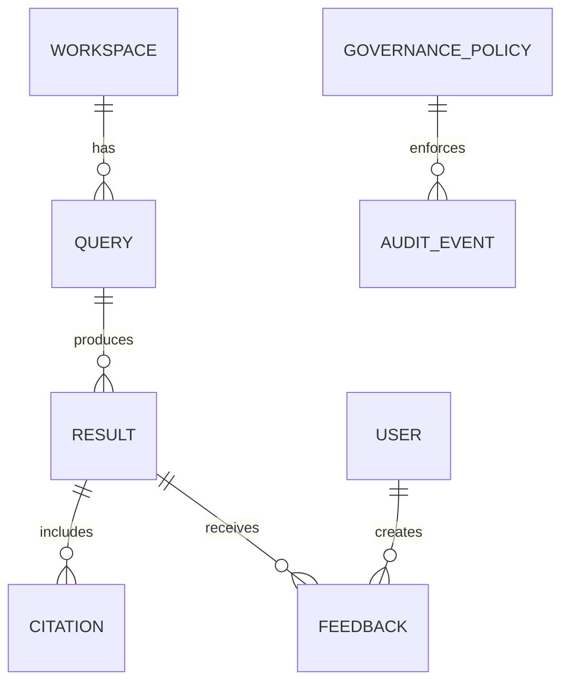
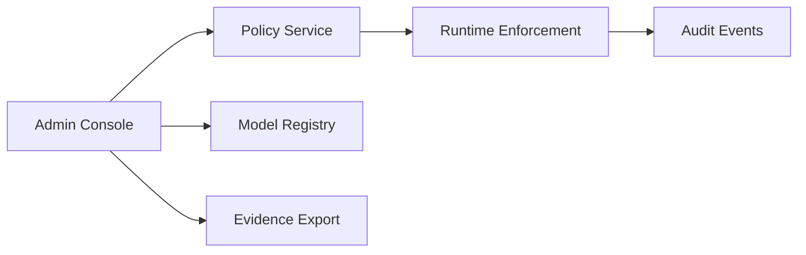
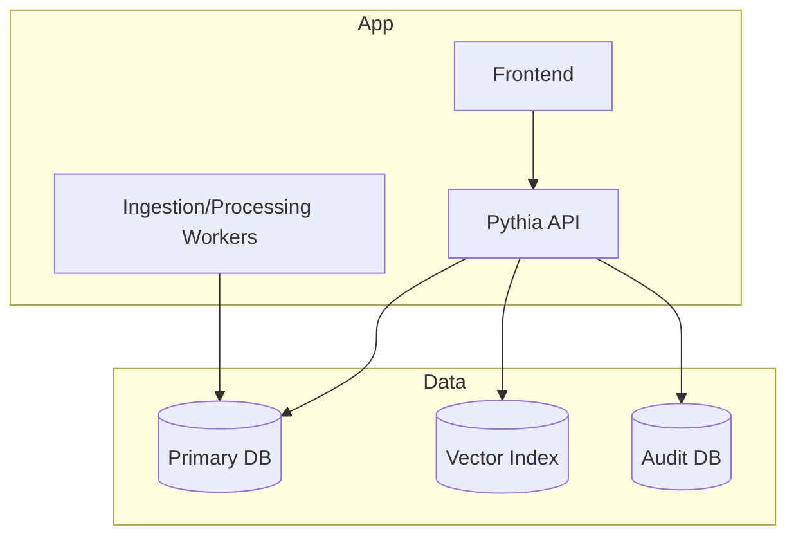

# Pythia Architecture Diagrams (v2)

## 1) High-Level System

```mermaid
graph LR
  User[Analyst/User] --> UI[Web UI / Terminal]
  UI --> API[Pythia API Layer]
  API --> RET[Retrieval Engine]
  API --> SYN[Synthesis Engine]
  API --> GOV[Governance Layer]
  RET --> SRC[External/Internal Sources]
  API --> DB[(Operational Store)]
  GOV --> AUD[(Audit Store)]
```

## 2) Intelligence Pipeline

```mermaid
flowchart TD
  Q[User Query] --> R[Retriever]
  R --> RR[Rank/Relevance]
  RR --> S[Synthesizer]
  S --> V[Verifier]
  V --> O[Output with confidence + citations]
  O --> F[User feedback]
  F --> L[Learning/quality telemetry]
```

## 3) Data Model Overview

```mermaid
erDiagram
  WORKSPACE ||--o{ QUERY : has
  QUERY ||--o{ RESULT : produces
  RESULT ||--o{ CITATION : includes
  USER ||--o{ FEEDBACK : creates
  RESULT ||--o{ FEEDBACK : receives
  GOVERNANCE_POLICY ||--o{ AUDIT_EVENT : enforces
```

## 4) Governance & Controls

```mermaid
flowchart LR
  Admin[Admin Console] --> Policy[Policy Service]
  Admin --> Models[Model Registry]
  Admin --> Evidence[Evidence Export]
  Policy --> Runtime[Runtime Enforcement]
  Runtime --> Audit[Audit Events]
```

## 5) Deployment Topology

```mermaid
graph TB
  subgraph App
    UI[Frontend]
    API[Pythia API]
    WORKERS[Ingestion/Processing Workers]
  end
  subgraph Data
    DB[(Primary DB)]
    VEC[(Vector Index)]
    AUD[(Audit DB)]
  end
  UI --> API
  API --> DB
  API --> VEC
  WORKERS --> DB
  API --> AUD
```
